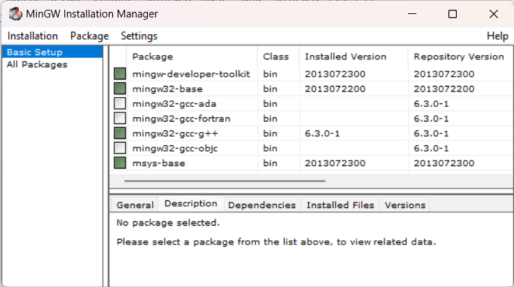

## Windows users
### Install [MinGW](https://sourceforge.net/projects/mingw/) to build and run your C projects.
Ubder `Basic Setup` Choose `mingw32-base` and `mingw32-gcc-g++`


## Linux users
### Install gcc & make
```
sudo apt install gcc
sudo apt install make
```